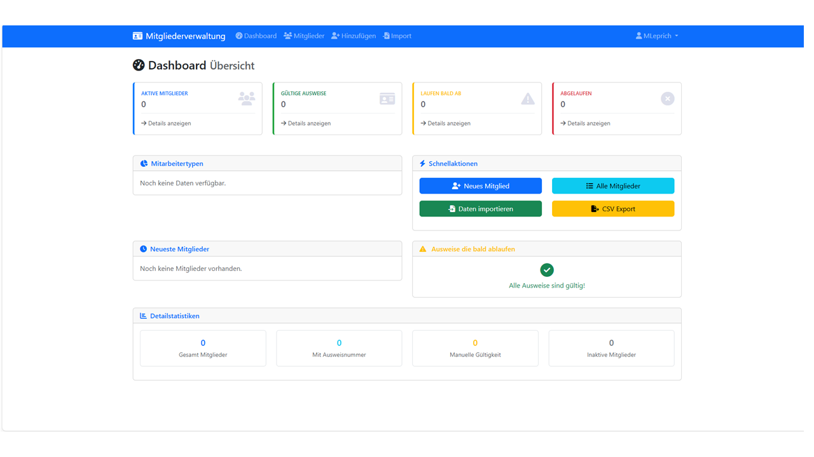
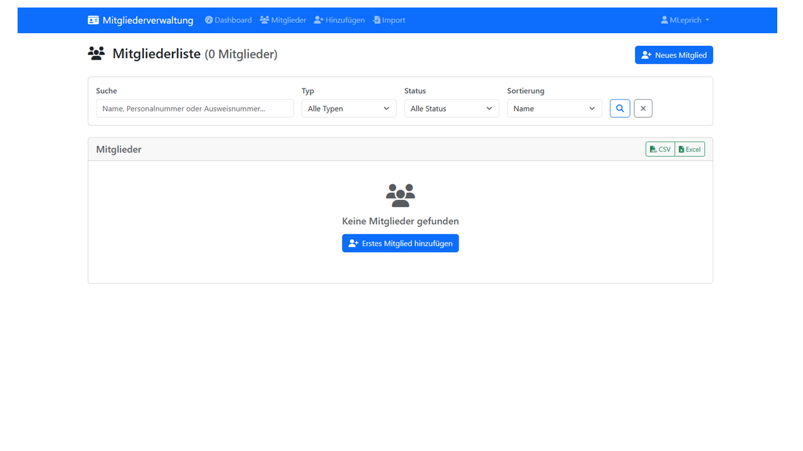

# 🆔 Mitgliederverwaltung Dashboard

Ein Django-basiertes Web-Dashboard für die Verwaltung von Mitgliederdaten zur Erstellung von Dienstausweisen mit integrierter Webcam-Funktionalität.

## 📸 Screenshots

### Dashboard-Übersicht

*Modernes Dashboard mit Statistiken, Mitarbeitertypen-Verteilung und ablaufenden Ausweisen*

### Mitglieder-Verwaltung

*Komplette Mitgliederliste mit Such-, Filter- und Export-Funktionen*

### Mitglied hinzufügen mit Webcam

*Neues Mitglied erfassen mit Live-Webcam-Integration für Passbilder*

## 🚀 Live-Demo

Sehen Sie das System in Aktion:

| Feature | Screenshot | Beschreibung |
|---------|------------|--------------|
| **📊 Dashboard** |  | Zentrale Übersicht mit Statistiken und Quick-Actions |
| **👥 Mitgliederliste** |  | Vollständige Verwaltung mit Suche und Filterung |
| **📷 Webcam-Integration** |  | Live-Fotoaufnahme für professionelle Passbilder |

## ✨ Features

### 👥 Mitgliederverwaltung
- **Vollständige CRUD-Operationen** (Erstellen, Bearbeiten, Löschen, Anzeigen)
- **Automatische Ausweisnummern-Generierung** mit konfigurierbaren Präfixen
- **Flexible Gültigkeitsdaten** (automatisch oder manuell)
- **Verschiedene Mitarbeitertypen** (BF, FF, JF, Stadt, Extern, Praktikant)
- **Such- und Filterfunktionen** nach Name, Typ, Status
- **Bulk-Export** mit angewandten Filtern


*Professionelle Mitgliederverwaltung: Übersichtliche Liste mit Profilbildern, Status-Badges und direkten Aktionen*

### 📷 Webcam-Integration
- **Live-Webcam-Aufnahme** direkt im Browser (HTTPS erforderlich)
- **Automatische Bildoptimierung** für Dienstausweis-Druck (267x400px, 300 DPI)
- **Center-Crop-Funktionalität** für perfekte Passbilder
- **Kompatibel mit professionellen Webcams** (getestet mit Logitech C922)
- **Fallback auf Datei-Upload** für Flexibilität
- **Live-Preview** mit Retake-Option für optimale Ergebnisse


*Echte Webcam-Integration: Live-Preview → Foto aufnehmen → Automatische Optimierung*

### 🖼️ Bildverarbeitung
- **Automatische EXIF-Orientierung** Korrektur
- **Professionelle Druckqualität** (JPEG, 95% Qualität, 300 DPI)
- **Bildformat-Validierung** (JPEG, PNG, TIFF, BMP)
- **Größenbeschränkungen** (min. 200x300px, max. 4000x6000px, max. 10MB)

### 📊 Dashboard & Reports  
- **Moderne Web-Oberfläche** mit Bootstrap 5
- **Statistik-Dashboard** mit Kacheln und Charts
- **Ablaufende Ausweise** Überwachung (30-Tage-Vorschau)
- **Mitarbeitertypen-Verteilung** mit Icons und Prozentangaben
- **Neueste Mitglieder** Anzeige
- **Schnellaktionen** für häufige Aufgaben


*Zentrales Dashboard: Statistiken auf einen Blick und direkter Zugriff auf alle Funktionen*

### 📄 Import/Export
- **CSV/Excel Import** für Massendatenverarbeitung
- **Robuste Datums-Konvertierung** (verschiedene Formate unterstützt)
- **Duplikat-Erkennung** basierend auf Name + Geburtsdatum
- **CSV/Excel Export** mit konfigurierbaren Filtern
- **Import-Vorlage** zum Download verfügbar

### 🔒 Sicherheit & Deployment
- **HTTPS-Unterstützung** mit selbstsignierten Zertifikaten
- **Nginx Reverse Proxy** Konfiguration
- **Benutzerauthentifizierung** mit Django Auth
- **Static Files Serving** über Nginx oder WhiteNoise
- **Production-ready** Einstellungen

### 🔗 Integration
- **Cardpresso-Integration** vorbereitet für Ausweisdruck
- **REST-API** Endpoints für externe Systeme
- **WhiteNoise** für Static Files (Fallback ohne Nginx)
- **Responsive Design** für alle Geräte (Desktop, Tablet, Mobile)

## 🎯 Hauptfunktionen im Detail

### 🆔 Dienstausweis-optimierte Bildaufnahme
Das System ist speziell für die Erstellung von professionellen Dienstausweisen entwickelt:

- **📐 Automatisches Passbild-Format**: Webcam-Aufnahmen werden automatisch auf 2:3 Seitenverhältnis zugeschnitten
- **🖨️ Druckoptimierung**: 267x400 Pixel bei 300 DPI für gestochen scharfe Ausdrucke
- **🔄 EXIF-Korrektur**: Automatische Orientierung unabhängig von der Kamera-Position
- **⚡ Live-Preview**: Sofortiges visuelles Feedback vor der Aufnahme

### 📊 Intelligente Mitgliederverwaltung
Entwickelt für Feuerwehren und öffentliche Einrichtungen:

- **🏷️ Automatische Kategorisierung**: BF, FF, JF, Stadt, Externe, Praktikanten
- **📅 Smarte Gültigkeit**: Automatische Berechnung (5 Jahre Standard, 1 Jahr für Externe)
- **🔢 Eindeutige Ausweisnummern**: Automatische Generierung mit konfigurierbaren Präfixen
- **⚠️ Ablauf-Monitoring**: 30-Tage-Vorschau für ablaufende Ausweise

## 🚀 Installation

### Voraussetzungen
- **Raspberry Pi 4** (oder Linux Server)
- **Python 3.8+**
- **Git**
- **Webcam** (optional, für Live-Aufnahmen)
- **HTTPS-Setup** (für Webcam-Funktionalität)

### Schnellinstallation

```bash
# Repository klonen
git clone https://github.com/DEIN-USERNAME/mitgliederverwaltung.git
cd mitgliederverwaltung

# Virtual Environment erstellen
python3 -m venv venv
source venv/bin/activate

# Dependencies installieren
pip install -r requirements.txt

# Environment-Datei erstellen
cp .env.template .env
# Bearbeite .env mit deinen Einstellungen!

# Datenbank einrichten
python manage.py migrate

# Superuser erstellen
python manage.py createsuperuser

# Static Files sammeln
python manage.py collectstatic

# Media-Ordner Berechtigungen setzen
sudo chown -R pi:www-data media/
sudo chmod -R 755 media/
sudo chmod g+s media/profile_pics/

# Development Server starten
python manage.py runserver 0.0.0.0:8000
```

## 🔧 Production Setup (Raspberry Pi)

### 1. Gunicorn Service einrichten

```bash
# Service-Datei erstellen
sudo nano /etc/systemd/system/mitgliederverwaltung.service
```

```ini
[Unit]
Description=Mitgliederverwaltung Django App
After=network.target

[Service]
User=pi
Group=www-data
WorkingDirectory=/home/pi/mitgliederverwaltung
Environment="PATH=/home/pi/mitgliederverwaltung/venv/bin"
ExecStart=/home/pi/mitgliederverwaltung/venv/bin/gunicorn --workers 3 --bind 127.0.0.1:8000 mitgliederverwaltung.wsgi:application
Restart=always
RestartSec=3

[Install]
WantedBy=multi-user.target
```

```bash
# Service aktivieren
sudo systemctl daemon-reload
sudo systemctl enable mitgliederverwaltung
sudo systemctl start mitgliederverwaltung
```

### 2. HTTPS mit Nginx einrichten

```bash
# HTTPS-Setup ausführen
chmod +x https_setup.sh
sudo ./https_setup.sh
```

Das Script erstellt:
- Selbstsigniertes SSL-Zertifikat
- Nginx-Konfiguration mit HTTPS
- Automatische HTTP→HTTPS Weiterleitung
- Optimierte Static Files Serving

### 3. Firewall konfigurieren

```bash
sudo ufw allow 22    # SSH
sudo ufw allow 80    # HTTP
sudo ufw allow 443   # HTTPS
sudo ufw enable
```

## 📷 Webcam-Setup

### Unterstützte Webcams
- **Logitech C922** (getestet, empfohlen)
- **Logitech C920/C930e**
- **Alle UVC-kompatiblen Webcams**

### Browser-Anforderungen
- **HTTPS-Verbindung** (erforderlich für getUserMedia)
- **Moderne Browser**: Chrome 53+, Firefox 36+, Safari 11+
- **Kamera-Berechtigung** muss erteilt werden

### Webcam-Funktionen
- **Live-Preview** mit 1280x720 Auflösung
- **Automatischer Center-Crop** auf Passbild-Format (2:3)
- **Optimierte Ausgabe** für Dienstausweis-Druck
- **Retake-Funktionalität** für perfekte Aufnahmen

## 📁 Projektstruktur

```
mitgliederverwaltung/
├── 📁 members/              # Hauptanwendung
│   ├── 📁 models.py         # Datenmodelle (Member, etc.)
│   ├── 📁 views.py          # View-Logik + Webcam-Processing
│   ├── 📁 forms.py          # Django-Forms mit Validierung
│   └── 📁 templates/        # HTML-Templates
├── 📁 templates/            # Globale Templates
│   ├── 📄 base.html         # Basis-Template
│   └── 📁 members/          # Member-spezifische Templates
├── 📁 static/               # Static Files (CSS, JS, Images)
│   ├── 📁 css/              # Custom CSS
│   ├── 📁 js/               # JavaScript (Webcam-Integration)
│   └── 📁 files/            # Vorlagen und Assets
├── 📁 media/                # User Uploads
│   └── 📁 profile_pics/     # Profilbilder (automatisch erstellt)
├── 📄 manage.py             # Django Management
├── 📄 requirements.txt      # Python Dependencies
└── 📄 https_setup.sh        # HTTPS-Setup Script
```

## 🔧 Konfiguration

### Environment Variables (.env)

```env
# Django Settings
SECRET_KEY=your-super-secret-key-here
DEBUG=False
ALLOWED_HOSTS=localhost,127.0.0.1,192.168.1.136,yourdomain.com

# Database
DATABASE_NAME=db.sqlite3

# Static/Media Files
STATIC_ROOT=/home/pi/mitgliederverwaltung/staticfiles
MEDIA_ROOT=/home/pi/mitgliederverwaltung/media

# File Upload Settings
MAX_UPLOAD_SIZE=10485760  # 10MB in Bytes
ALLOWED_IMAGE_TYPES=jpg,jpeg,png,tiff,bmp
```

### Django Settings Highlights

```python
# Optimierte Bild-Upload Settings
FILE_UPLOAD_PERMISSIONS = 0o644
FILE_UPLOAD_DIRECTORY_PERMISSIONS = 0o755

# Datums-Format für Deutsche Lokalisierung
DATE_INPUT_FORMATS = ['%Y-%m-%d', '%d.%m.%Y', '%d/%m/%Y']
LANGUAGE_CODE = 'de-de'
TIME_ZONE = 'Europe/Berlin'

# Production-Security
SECURE_BROWSER_XSS_FILTER = True
SECURE_CONTENT_TYPE_NOSNIFF = True
X_FRAME_OPTIONS = 'DENY'
```

## 📊 Verwendung

### 1. Mitglied hinzufügen
1. **Dashboard öffnen** → "Neues Mitglied"
2. **Persönliche Daten** eingeben
3. **Mitarbeitertyp** wählen (automatische Präfix-Vorschläge)
4. **Profilbild** per Webcam aufnehmen oder Datei hochladen
5. **Ausweis-Daten** eingeben (automatische Gültigkeitsberechnung)

### 2. Webcam-Aufnahme
1. **"Webcam verwenden"** klicken
2. **Kamera-Berechtigung** erteilen
3. **Live-Preview** überprüfen
4. **"Foto aufnehmen"** klicken
5. **Bei Bedarf wiederholen** mit "Erneut aufnehmen"

### 3. CSV-Import
1. **CSV-Vorlage** herunterladen
2. **Daten eingeben** (UTF-8, deutsche Datumsformate)
3. **"Daten importieren"** → CSV auswählen
4. **Import-Ergebnis** prüfen (Erfolg/Fehler-Protokoll)

### 4. Ausweise verwalten
- **Dashboard-Kacheln** für schnelle Übersicht
- **Ablaufende Ausweise** automatisch erkannt
- **Filter und Suche** für große Datenbestände
- **Export-Funktionen** für externe Systeme

## 🛠️ Troubleshooting

### Webcam-Probleme
```bash
# Browser-Console für Debug-Meldungen prüfen (F12)
# Häufige Lösungen:

# 1. HTTPS erforderlich
# - Nur unter HTTPS/localhost funktionsfähig
# - Selbstsigniertes Zertifikat akzeptieren

# 2. Kamera-Berechtigung
# - Browser-Adressleiste: Kamera-Symbol → "Zulassen"
# - Bei "dauerhaft blockiert": Browser-Einstellungen zurücksetzen

# 3. Kamera bereits in Verwendung
# - Andere Browser-Tabs mit Kamera schließen
# - Skype, Teams, OBS beenden
# - Browser neu starten
```

### Permission-Errors
```bash
# Media-Ordner Berechtigungen reparieren
sudo chown -R pi:www-data /home/pi/mitgliederverwaltung/media/
sudo chmod -R 755 /home/pi/mitgliederverwaltung/media/
sudo chmod g+s /home/pi/mitgliederverwaltung/media/profile_pics/

# Static Files Berechtigungen (falls 403-Errors)
sudo chmod 755 /home/pi
sudo chmod 755 /home/pi/mitgliederverwaltung
sudo systemctl restart nginx
```

### Service-Probleme
```bash
# Django Service Status prüfen
sudo systemctl status mitgliederverwaltung

# Logs anzeigen
sudo journalctl -u mitgliederverwaltung -f

# Service neu starten
sudo systemctl restart mitgliederverwaltung
sudo systemctl restart nginx
```

## 🤝 Beitragen

1. **Fork** das Repository
2. **Feature Branch** erstellen (`git checkout -b feature/AmazingFeature`)
3. **Changes committen** (`git commit -m 'Add AmazingFeature'`)
4. **Branch pushen** (`git push origin feature/AmazingFeature`)
5. **Pull Request** öffnen

## 📋 Roadmap

- [x] **Webcam-Integration** mit Live-Preview
- [x] **HTTPS-Setup** für Production
- [x] **Automatische Bildoptimierung**
- [ ] **Cardpresso-API Integration**
- [ ] **Bulk-Actions** für Mitglieder
- [ ] **Advanced Reporting** mit Charts
- [ ] **REST API** für Mobile Apps
- [ ] **Docker Container** für einfaches Deployment
- [ ] **Backup/Restore** Funktionalität

## 📜 Lizenz

Dieses Projekt steht unter der [MIT Lizenz](LICENSE).

## 🙏 Danksagungen

- **Django Team** für das hervorragende Framework
- **Bootstrap** für das responsive CSS-Framework  
- **Logitech** für die ausgezeichneten Webcams
- **Pillow** für die Bildverarbeitung
- **Community** für Feedback und Beiträge

## 📞 Support

Bei Fragen oder Problemen:

1. **Issues** im GitHub Repository erstellen
2. **Logs sammeln** (`journalctl`, Browser-Console)
3. **System-Info** angeben (Raspberry Pi Model, Browser, etc.)
4. **Screenshots** bei UI-Problemen beifügen

---

**⭐ Wenn dieses Projekt hilfreich war, gib ihm einen Stern auf GitHub!**
